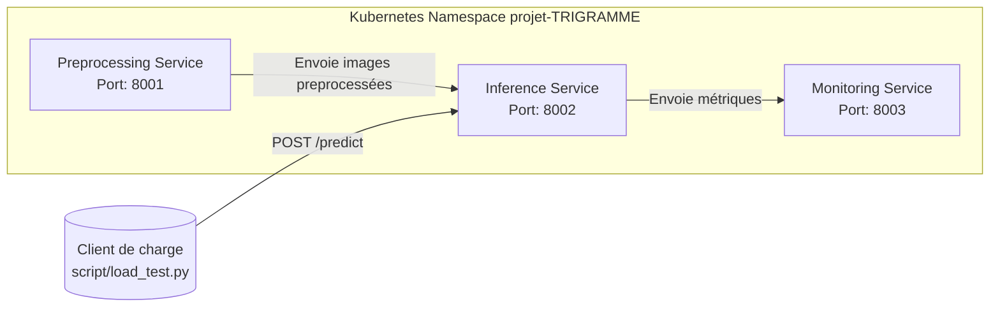

# Plan de Réalisation - Cas 1 : Analyse d'Images Dermatologiques

## 1. Contexte et Objectifs

**Contexte métier** : Un service de dermatologie reçoit des photographies de lésions cutanées et doit les trier avant l'examen du médecin. Les cas bénins sont dépriorisés, les cas suspects déclenchent une analyse plus fine.

**Quota imposé (Cas 1)** :
| Ressource | Quota |
|-----------|-------|
| CPU | 3500m (3.5 cores) |
| Mémoire | 5 Gi |

**Défi spécifique** : Une image JPEG de 800 Ko représente environ 600 Ko à 1 Mo en mémoire décompressée. Sous charge (50 req/min), le preprocessing manipule plusieurs images simultanément. L'allocation mémoire doit tenir compte de cette concurrence.

---

## 2. Architecture Cible



### Services

| Service | Rôle | Technologies |
|---------|------|--------------|
| **Preprocessing** | Reçoit les images brutes, les prépare (redimensionnement, normalisation), les transmet à l'inférence | Python, OpenCV/PIL, Flask |
| **Inference** | Charge le modèle ML entraîné, répond aux requêtes de prédiction, expose une API REST | Python, PyTorch/TensorFlow, Flask |
| **Monitoring** | Enregistre les requêtes et prédictions, expose des métriques lisibles (volume, latence, taux d'erreur) | Python, Flask |

---

## 3. Plan de Travail Détaillé

### Phase 1 : Architecture Decision Record (ADR)

- [ ] **1.1** Choisir et justifier le cas d'usage (Cas 1 - Analyse d'images dermatologiques)
- [ ] **1.2** Estimer la mémoire nécessaire par service :
  - Modèle MobileNetV2/EfficientNet-B0 : ~10-40 Mo de poids
  - Image décompressée : 600 Ko - 1 Mo
  - Concurrence sous charge : multiplier par le nombre d'images traitées simultanément
  - Overhead Python : ~200-300 Mo par process
- [ ] **1.3** Identifier le dataset HAM10000 et sa licence (CC BY-NC 4.0)
- [ ] **1.4** Décider de la communication inter-services (noms DNS Kubernetes)
- [ ] **1.5** Choisir l'outil CI/CD et justifier par au moins 2 critères
- [ ] **1.6** Déterminer la stratégie de déploiement (RollingUpdate vs Recreate) avec calcul de marge
- [ ] **1.7** Rédiger l'ADR en document de 2 pages maximum

### Phase 2 : Préparation des Données et Entraînement des Modèles

- [ ] **2.1** Télécharger le dataset HAM10000 depuis Harvard Dataverse
- [ ] **2.2** Préparer les données :
  - Organiser les images JPEG
  - Créer le CSV d'annotations
  - Diviser en train/validation/test
- [ ] **2.3** Entraîner le **premier modèle** (classifieur binaire bénin/malin) :
  - Choisir MobileNetV2 ou EfficientNet-B0
  - Fine-tuner sur les 7 classes regroupées en 2 catégories (bénin/malin)
  - Entraîner hors Minikube (Google Colab ou local)
  - Sauvegarder l'artefact (.pt ou .h5) dans `models/`
- [ ] **2.4** Entraîner le **deuxième modèle** (classifieur multi-classes 7 types de lésions) :
  - Appelé uniquement si le premier modèle détecte une anomalie
  - Sauvegarder l'artefact dans `models/`
- [ ] **2.5** (Optionnel) Entraîner le **troisième modèle** (Grad-CAM pour cartes de chaleur)
- [ ] **2.6** Créer `models/README.md` avec :
  - Dataset utilisé
  - Métrique principale (accuracy, F1, AUC)
  - Taille de l'artefact
  - Temps d'inférence moyen mesuré en local

### Phase 3 : Développement des Services

- [ ] **3.1** Service de **Preprocessing** (`services/preprocessing/`) :
  - Recevoir les images brutes (multipart/form-data)
  - Redimensionner et normaliser les images
  - Transmettre au service d'inférence
  - Exposer une API REST sur le port 8001
- [ ] **3.2** Service d'**Inference** (`services/inference/`) :
  - Charger les modèles entraînés au démarrage
  - Exposer l'endpoint `POST /predict`
  - Retourner JSON : `{"prediction": "malignant", "confidence": 0.87, "class_detail": "melanoma"}`
  - Gérer le pipeline : preprocessing -> inférence binaire -> inférence multi-classes si anomalie
- [ ] **3.3** Service de **Monitoring** (`services/monitoring/`) :
  - Enregistrer les requêtes et prédictions
  - Exposer des métriques lisibles (volume, latence, taux d'erreur)
  - Exposer des métriques Prometheus sur le port 8003

### Phase 4 : Containerisation

- [ ] **4.1** Créer les `Dockerfile` pour chaque service :
  - `services/preprocessing/Dockerfile`
  - `services/inference/Dockerfile`
  - `services/monitoring/Dockerfile`
  - Utiliser des versions pinned pour toutes les dépendances
  - Multi-stage build si images > 1 Go avec justification
- [ ] **4.2** Créer les `requirements.txt` pour chaque service
- [ ] **4.3** Tester localement avec `docker-compose up`
- [ ] **4.4** Pousser les images sur Docker Hub avec un tag de version

### Phase 5 : Déploiement Kubernetes

- [ ] **5.1** Créer le namespace :
  ```bash
  kubectl create namespace projet-TRIGRAMME
  ```
- [ ] **5.2** Créer `k8s/quota.yaml` pour le Cas 1 :
  ```yaml
  apiVersion: v1
  kind: ResourceQuota
  metadata:
    name: projet-quota
  spec:
    hard:
      requests.cpu: "3500m"
      requests.memory: "5Gi"
      limits.cpu: "3500m"
      limits.memory: "5Gi"
  ```
- [ ] **5.3** Créer `k8s/limitrange.yaml` avec min/max/default pour les conteneurs
- [ ] **5.4** Créer les manifests Kubernetes :
  - `k8s/preprocessing.yaml`
  - `k8s/inference.yaml`
  - `k8s/monitoring.yaml`
  - Inclure les `requests` et `limits` basés sur des mesures réelles
- [ ] **5.5** Déployer l'ensemble :
  ```bash
  kubectl apply -f k8s/ -n projet-TRIGRAMME
  ```
- [ ] **5.6** Vérifier que tous les pods sont en état `Running`

### Phase 6 : Pipeline CI/CD

- [ ] **6.1** Créer le pipeline CI/CD (`.github/workflows/ci.yml`) :
  - Exécuter les tests (seuil de couverture 80%)
  - Construire les images Docker
  - Pousser les images sur Docker Hub
  - Échouer si les tests échouent
- [ ] **6.2** Gérer les secrets (Docker Hub credentials) de manière sécurisée
- [ ] **6.3** S'assurer que le pipeline se déclenche sur les push vers `main`

### Phase 7 : Tests de Charge et Optimisation

- [ ] **7.1** Exécuter les trois niveaux de charge imposés :
  - **Nominal** (10 req/min, 5 min)
  - **Charge** (50 req/min, 5 min)
  - **Stress** (150 req/min, 5 min)
- [ ] **7.2** Pour chaque niveau :
  - Relever `kubectl top pods`
  - Consigner les métriques du service de monitoring
  - Noter les pods OOMKillés ou throttlés
- [ ] **7.3** Identifier la correction la plus impactante et la mettre en oeuvre
- [ ] **7.4** Relancer le niveau problématique et mesurer l'effet avant/après
- [ ] **7.5** Créer un tableau comparatif avant/après avec justifications

### Phase 8 : Stress Test Extrême (Optionnel - Bonus)

- [ ] **8.1** Exécuter le stress test extrême avec `--level extreme`
- [ ] **8.2** Augmenter progressivement le rate : 200, 300, 500, etc.
- [ ] **8.3** Chaque palier testé pendant 5 minutes
- [ ] **8.4** Noter le dernier palier où le taux de réussites dépasse 80%
- [ ] **8.5** Identifier le point de rupture du système
- [ ] **8.6** Documenter dans `STRESS_TEST.md` :
  - Résultats bruts pour chaque palier
  - Identification du service qui a lâché en premier
  - Preuve via `kubectl describe pod` ou `kubectl logs`
  - Capture de récupération après 2 minutes
  - Proposition d'amélioration si les ressources étaient doublées

### Phase 9 : Documentation et Livrables Finaux

- [ ] **9.1** Créer `README.md` avec :
  - Section "Déploiement" en première section
  - Commandes dans l'ordre exact pour reproduire le système
  - Première commande : `git clone` puis déploiement
- [ ] **9.2** S'assurer que le repo se déploie sans modification manuelle depuis `git clone`
- [ ] **9.3** Préparer la démo live (pods Running, requête d'inférence, métriques monitoring)
- [ ] **9.4** Préparer le support visuel (diagramme d'architecture, tableau de dimensionnement)

---

## 4. Structure du Repo Attendue

```
/
├── .github/
│   └── workflows/
│       └── ci.yml
├── scripts/
│   └── load_test.py          # Fourni par l'enseignant, ne pas modifier
├── data/
│   └── images/               # Sous-ensemble HAM10000
│       ├── img_0001.jpg
│       ├── img_0002.jpg
│       └── ...
├── models/
│   ├── README.md
│   ├── binary_model.pt       # Modèle binaire bénin/malin
│   └── multiclass_model.pt   # Modèle multi-classes 7 types
├── services/
│   ├── preprocessing/
│   │   ├── Dockerfile
│   │   ├── requirements.txt
│   │   └── app.py
│   ├── inference/
│   │   ├── Dockerfile
│   │   ├── requirements.txt
│   │   └── app.py
│   └── monitoring/
│       ├── Dockerfile
│       ├── requirements.txt
│       └── app.py
├── k8s/
│   ├── quota.yaml
│   ├── limitrange.yaml
│   ├── preprocessing.yaml
│   ├── inference.yaml
│   └── monitoring.yaml
├── tests/
│   ├── test_preprocessing.py
│   ├── test_inference.py
│   └── test_monitoring.py
├── ADR.md
├── STRESS_TEST.md
└── README.md
```

---

## 5. Estimation des Ressources par Service

| Service | CPU Request | CPU Limit | Memory Request | Memory Limit |
|---------|-------------|-----------|----------------|--------------|
| Preprocessing | 500m | 800m | 512Mi | 768Mi |
| Inference | 1000m | 1500m | 1536Mi | 2048Mi |
| Monitoring | 200m | 300m | 256Mi | 512Mi |
| **Total** | **1700m** | **2600m** | **2304Mi** | **3328Mi** |

> Note : Ces valeurs sont des estimations. Elles doivent être ajustées après les mesures réelles avec `kubectl top pods`.

Règle de dimensionnement : fixer `requests` à 70-80% du pic observé sous charge normale, et `limits` à 120-130% du pic observé.

---

## 6. Commandes de Charge à Exécuter

```bash
# Nominal
python scripts/load_test.py --case images --level nominal --url http://$(minikube service inference-svc -n projet-TRIGRAMME --url | tail -1)/predict

# Charge
python scripts/load_test.py --case images --level charge --url http://$(minikube service inference-svc -n projet-TRIGRAMME --url | tail -1)/predict

# Stress
python scripts/load_test.py --case images --level stress --url http://$(minikube service inference-svc -n projet-TRIGRAMME --url | tail -1)/predict

# Extrême (exemple)
python scripts/load_test.py --case images --level extreme --rate 300 --url http://$(minikube service inference-svc -n projet-TRIGRAMME --url | tail -1)/predict
```

---

## 7. Points de Vigilance Spécifiques au Cas 1

1. **Mémoire sous charge** : Une image JPEG de 800 Ko représente 600 Ko à 1 Mo en mémoire décompressée. À 50 req/min, le preprocessing manipule plusieurs images simultanément.
2. **Deux modèles dans le pipeline** : Le deuxième modèle (multi-classes) n'est appelé que si le premier détecte une anomalie. Cela doit être documenté dans l'ADR.
3. **Point de rupture** : Identifier quel service lâche en premier (OOMKill, throttling CPU, time-out applicatif).
4. **Récupération** : Après le test extrême, le système doit retrouver un état stable en moins de 2 minutes.
